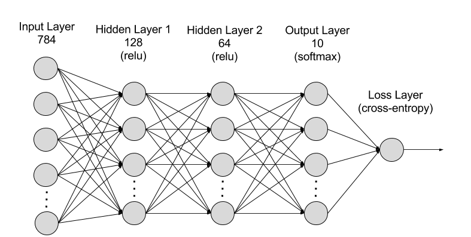
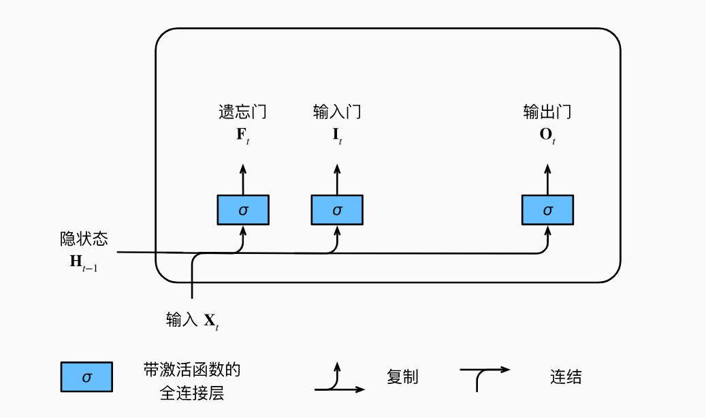
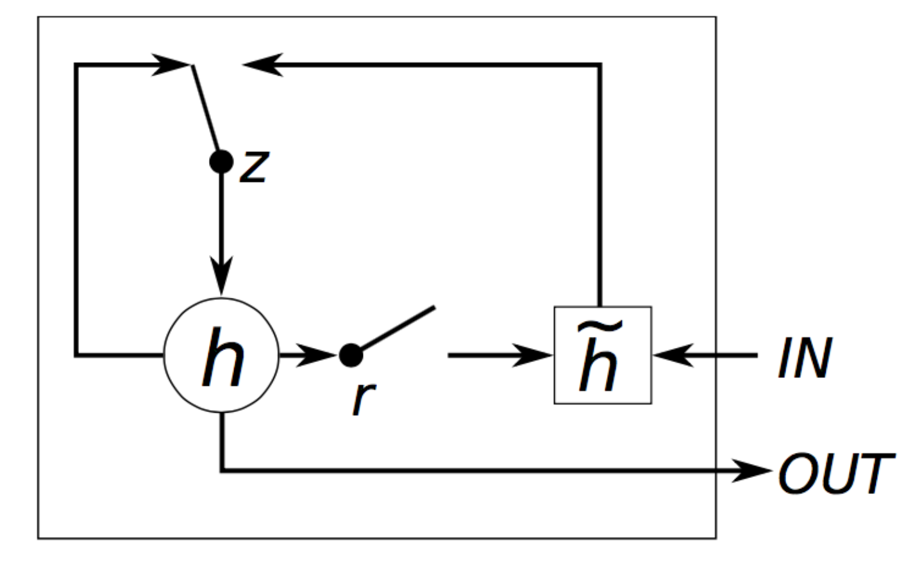
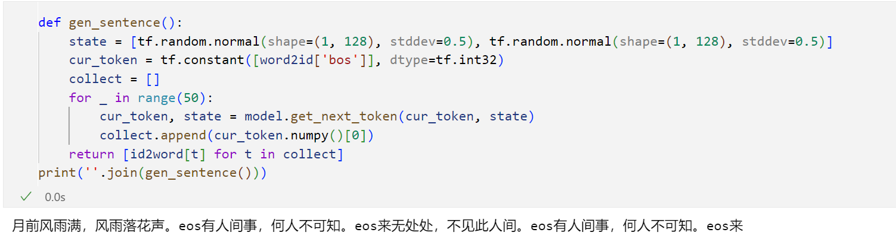
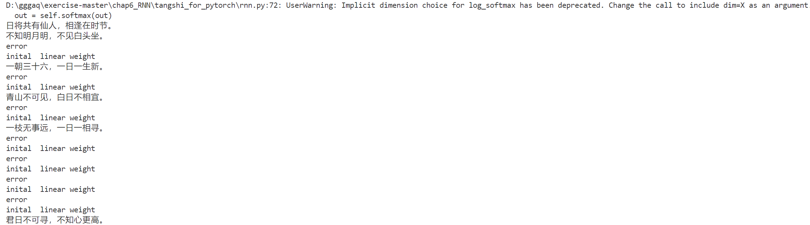

# 1. 补全代码
详情请参照代码
# 2. 模型解释
## RNN

RNN 由神经元组成，神经元是协同工作以执行复杂任务的数据处理节点。神经元分为输入层、输出层和隐藏层。输入层接收要处理的信息，输出层提供结果。数据处理、分析和预测在隐藏层中进行。 
RNN 的工作原理是将接收到的顺序数据逐步传递给隐藏层。但是，RNN 还有一个自循环或循环的工作流程：隐藏层可以在短期记忆组件中记住之前的输入并使用这些输入进行未来的预测。它使用当前输入和存储的记忆来预测下一个序列。 
例如，考虑以下序列：Apple is red。您想让 RNN 在接收输入序列 Apple is 时预测 red。当隐藏层处理 Apple 一词时，会在记忆中存储一份副本。随后，当接收到 is 一词时，它会从记忆中调取 Apple，并根据上下文理解完整序列：Apple is。然后，它可以预测 red 以提高准确性，这使得 RNN 在语音识别、机器翻译和其他语言建模任务中颇为有用。

## LSTM

长短期记忆（Long short-term memory, LSTM）是一种特殊的RNN，主要是为了解决长序列训练过程中的梯度消失和梯度爆炸问题。简单来说，就是相比普通的RNN，LSTM能够在更长的序列中有更好的表现
LSTM的设计灵感来自于计算机的逻辑门。 长短期记忆网络引入了记忆元（memory cell），或简称为单元（cell）。 有些文献认为记忆元是隐状态的一种特殊类型， 它们与隐状态具有相同的形状，其设计目的是用于记录附加的信息。 为了控制记忆元，我们需要许多门。 其中一个门用来从单元中输出条目，我们将其称为输出门（output gate）。 另外一个门用来决定何时将数据读入单元，我们将其称为输入门（input gate）。 我们还需要一种机制来重置单元的内容，由遗忘门（forget gate）来管理， 这种设计的动机与门控循环单元相同， 能够通过专用机制决定什么时候记忆或忽略隐状态中的输入。 

## GRU

GRU 背后的原理与 LSTM 非常相似，即用门控机制控制输入、记忆等信息而在当前时间步做出预测。
GRU 有两个有两个门，即一个重置门（reset gate）和一个更新门（update gate）。从直观上来说，重置门决定了如何将新的输入信息与前面的记忆相结合，更新门定义了前面记忆保存到当前时间步的量。如果我们将重置门设置为 1，更新门设置为 0，那么我们将再次获得标准 RNN 模型。使用门控机制学习长期依赖关系的基本思想和 LSTM 一致，但还是有一些关键区别：
- GRU 有两个门（重置门与更新门），而 LSTM 有三个门（输入门、遗忘门和输出门）。
- GRU 并不会控制并保留内部记忆（c_t），且没有 LSTM 中的输出门。
- LSTM 中的输入与遗忘门对应于 GRU 的更新门，重置门直接作用于前面的隐藏状态。
- 在计算输出时并不应用二阶非线性。

# 3. 诗歌生成过程
- 数据处理：通过处理文本数据，构建了诗歌的数据集，并进行了字符到索引的映射。使用了Python的collections.Counter对字符进行计数，并根据计数结果构建了字符到索引的映射字典。

- 模型构建：使用TensorFlow构建了RNN模型。采用了BasicRNNCell或BasicLSTMCell作为RNN的基本单元，并使用MultiRNNCell进行多层堆叠。在构建模型时，通过tf.nn.embedding_lookup实现了字符的嵌入操作。

- 模型训练：使用了动态RNN（dynamic_rnn）进行模型的训练。通过Mini-batch的方式对数据进行训练，并通过梯度下降法更新模型参数。训练过程中保存了断点，以便中断后可以从中断处继续训练。

- 文本生成：训练结束后，使用模型生成诗歌。通过将训练结束后的最终状态（last_state）作为初始状态传入RNN，生成下一个字符，并不断迭代生成整篇诗歌。

# 4. 结果

